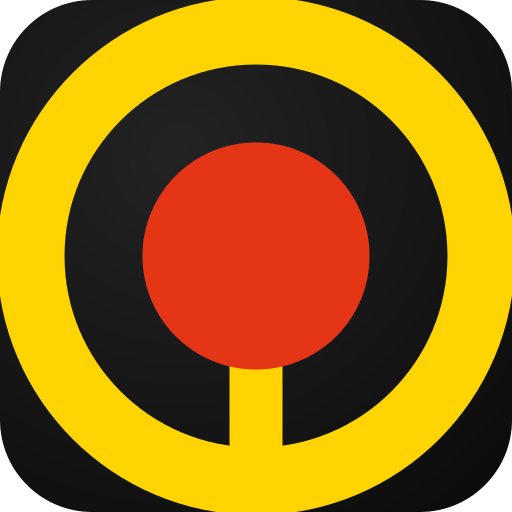

# Loop Colors Palette Planner

A mobile-first web app for planning graffiti mural colour palettes using the real
**Loop Colors 400ml** spray paint range. Assign cans to mural elements (fill,
outline, 3D, background, highlights, characters…), then export a shareable PNG so
the crew knows exactly which cans to buy.

**Live:** https://colours.stuc.dev



## Features

- **216 real Loop Colors cans** — searchable by colour name or `LP-xxx` code.
- **Elements list** — name each mural part, assign one or more cans, add/remove freely.
- **Full-screen colour picker** — tap a swatch or `+` to browse the whole range.
- **PNG export** — renders a 1080px "can list" on a dark concrete-wall background
  with a marker-style title, ready to share. Uses the Web Share API (so it drops
  straight into WhatsApp on mobile) with a download fallback.
- **PWA** — installable to the home screen; self-hosted fonts; works offline-ish.
- Built for **iOS Safari** and **Android Chrome**, with safe-area insets and
  44px touch targets. No framework — plain static HTML/CSS/JS.

## Colour data

Colours are parsed **at build time** from `loop_colors.xlsx` in
[stuartcarroll/SprayPaintSwatches](https://github.com/stuartcarroll/SprayPaintSwatches)
into a static array (`public/colors.js`) — there is no runtime fetch. Five core
black/white cans absent from the sheet (LP-100/101/103/104/105) are added manually,
for 216 total. Thanks to **SprayPaintSwatches** for the swatch data.

## Development

```bash
npm install
npm run build      # regenerate public/colors.js + PWA icons
npm run dev        # serve public/ at http://localhost:4321
```

## Deployment

Deployed as a static site on **Cloudflare Workers (static assets)**:

```bash
npm run deploy     # wrangler deploy — serves ./public, binds colours.stuc.dev
```

## Project structure

```
public/            # the deployed static site
  index.html
  styles.css
  app.js           # UI + state + picker + share
  export.js        # 1080px canvas renderer
  colors.js        # generated — 216 cans
  fonts/           # self-hosted Permanent Marker + Barlow Condensed (woff2)
  icons/           # PWA icons
  manifest.webmanifest
scripts/
  build-colors.mjs # xlsx -> colors.js
  make-icons.mjs   # SVG -> PNG icons
  serve.mjs        # local dev server
data/loop_colors.xlsx
wrangler.jsonc
```

## License

MIT
